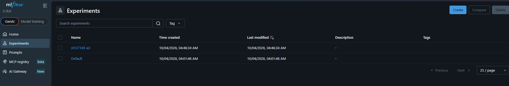
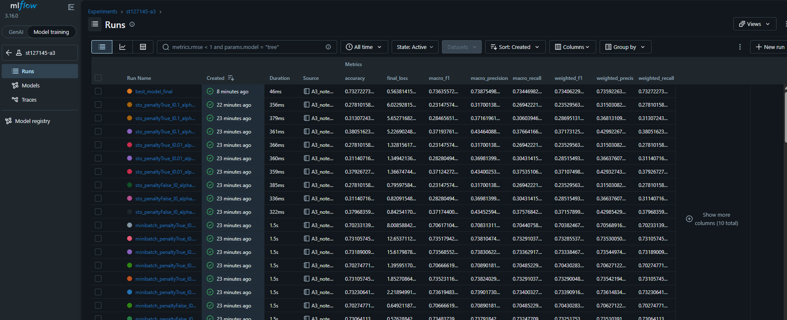
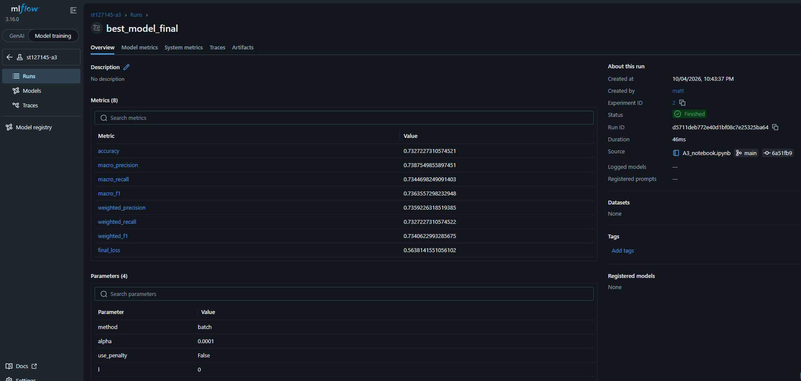
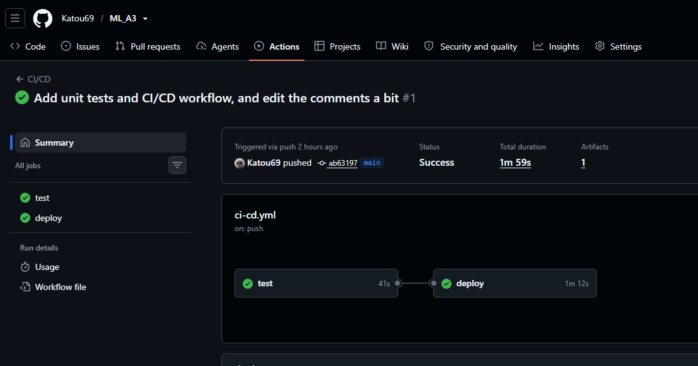
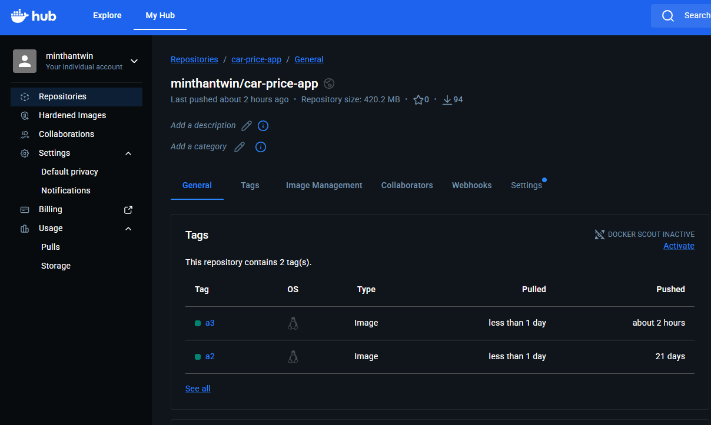

# A3: Predicting Car Price (Classification)

AT82.03 Machine Learning, Assignment 3. Student ID: **st127145**

This project keeps using the Car Price dataset but treats price prediction as a
**4-class classification problem**: instead of guessing an exact price, the model sorts each car
into one of 4 price groups. The model is a multinomial (softmax) logistic regression
**written from scratch** with NumPy. On top of the course code I added hand-written classification
metrics and an optional Ridge (L2) penalty, compared settings with MLflow, built a Dash web app
around the model, and set up GitHub Actions for testing and building the Docker image.

## What is in this repo

```
.
├── A3_notebook.ipynb            # full experiment: cleaning, training, metrics, MLflow
├── test_model.py                # unit tests for the model (run by CI)
├── .github/workflows/ci-cd.yml  # GitHub Actions: test, then build and push the Docker image
├── screenshots/                 # MLflow and CI/CD screenshots
└── app/
    ├── Dockerfile
    └── code/
        ├── app.py                   # Dash app (3 pages)
        ├── logistic_regression.py   # from-scratch LogisticRegression class
        ├── model_classes.py         # A2 regression classes (needed to load model_v2.pkl)
        ├── requirements.txt
        └── models/                  # saved models and preprocessing files (.pkl)
```

## Task 1: Classification

**Price groups.** The preprocessing is the same as in A1 and A2 (units removed, brand taken from the
name, missing values filled, text columns one-hot encoded, numbers scaled). The selling price is then
split into 4 groups with `pd.qcut` on the training data, so each group has about the same number of cars
(about 1400 each). The group boundaries come from the **training data only**, and the same boundaries are
applied to the test data, so the test set never leaks into training.

| Class | Price range |
|---|---|
| 0 | 29,999 to 254,999 |
| 1 | 254,999 to 450,000 |
| 2 | 450,000 to 685,000 |
| 3 | 685,000 to 6,000,000 |

**`LogisticRegression` class** (`app/code/logistic_regression.py`), built from the course notebook
with these additions:

- `accuracy`, per-class `precision`, `recall` and `f1_score`, all written from scratch
- `macro_*` and `weighted_*` versions of precision, recall and f1
- `classification_report_scratch`, which prints a report in the same layout as scikit-learn
- an optional **Ridge (L2) penalty** (Task 2), switched on with `use_penalty` and set with `l`:
  `loss + l * sum(W^2)` and `gradient + 2 * l * W`
- training with `batch`, `minibatch` or `sto` gradient descent

**Check against scikit-learn.** My scratch metrics and `sklearn.metrics.classification_report` were run
on the same predictions, and their results match (see the notebook).

**What does "support" mean?** In the classification report, support is the number of actual samples
of each class in the test set. It shows how much data each row's precision, recall and f1 are based on,
and it is also the weight used for the weighted averages.

## Task 2: Ridge penalty and experiments

I compared **27 runs** in MLflow (run on a local MLflow server, as allowed by the course announcement):

- gradient descent method: batch, minibatch, sto
- Ridge penalty: off, or on with strength 0.01 or 0.1
- learning rate: 0.0001, 0.00005, 0.00001

The best run was picked by macro F1 and then retrained with more iterations:

| Setting | Value |
|---|---|
| Method | batch |
| Ridge penalty | off |
| Learning rate | 0.0001 |
| Iterations | 10,000 |
| **Test accuracy** | **0.7327** |
| **Macro F1** | **0.7364** |

**Findings**

- **Small learning rates were needed.** A first test with a rate of 0.1 made the loss jump around at about
  12 and never settle, because the gradient is a sum over all rows and is not averaged.
- **Batch and minibatch** both gave about 0.73 accuracy. Minibatch with the smallest rate (0.00001) fell to
  about 0.70, because its steps were too small to finish learning.
- **Stochastic (sto)** did badly (0.28 to 0.38 accuracy). It uses one row per step, so 5000 steps is less than
  one pass over the 5600 training rows.
- **The Ridge penalty** changed the results by only about 0.001, so it did not clearly help. The model has
  only 42 features and does not overfit much.
- **Per class:** the cheapest and most expensive groups are the easiest (f1 about 0.85 and 0.80). The two
  middle groups are harder (about 0.68 and 0.62), because their price ranges overlap.
- The best run was chosen using the test set. A separate validation set would be cleaner.

### MLflow screenshots


*The MLflow experiment `st127145-a3`.*


*All 27 runs, with their parameters and scores side by side.*


*The best run: batch, no penalty, learning rate 0.0001.*

## Task 3: Web app and CI/CD

### Run the app

**With Docker (easiest):**

```bash
docker run -p 8050:8050 minthantwin/car-price-app:a3
```

Then open <http://localhost:8050>.

**Without Docker:**

```bash
cd app/code
pip install -r requirements.txt
python app.py
```

The app has three pages:

| Page | Model |
|---|---|
| `/` | Random Forest (A1) |
| `/new` | From-scratch regularized linear regression (A2) |
| `/classify` | **From-scratch softmax logistic regression (A3).** It predicts the price group. |

On the `/classify` page you fill in the car details and click *Predict Price Bracket*. The page shows a
price range such as "Budget (under 254,999)". Empty fields are filled in using the saved imputers and
default values.

### Unit tests

`test_model.py` has two tests (run with `pytest -v` from the repo root):

1. **The model takes the expected input.** The input has 43 columns (intercept plus 42 features), and
   input with the wrong number of columns is rejected.
2. **The output has the expected shape.** `predict` gives one label (0 to 3) per row, and the probability
   matrix has the shape `(rows, 4)` with each row adding up to 1.

### CI/CD (GitHub Actions)

`.github/workflows/ci-cd.yml` runs on every push:

1. **test:** installs the requirements and runs `pytest`.
2. **deploy:** runs only if `test` passed and the push is to `main`. It builds the Docker image from
   `app/` and pushes it to Docker Hub as `minthantwin/car-price-app:a3`.

Docker Hub login details are stored as GitHub repository secrets (`DOCKERHUB_USERNAME` and
`DOCKERHUB_TOKEN`).


*The workflow after a push: the `test` job passed, then the `deploy` job ran.*


*The image `minthantwin/car-price-app` with the tag `a3` on Docker Hub, pushed by the workflow.*

## Notes

- The models are implemented with NumPy. scikit-learn is used only for splitting the data, scaling,
  filling missing values, and for checking my metrics.
- `model_classes.py` is included because the A2 model (`model_v2.pkl`) is loaded by the app.
- The image is published on Docker Hub and can be run with the `docker run` command above.
